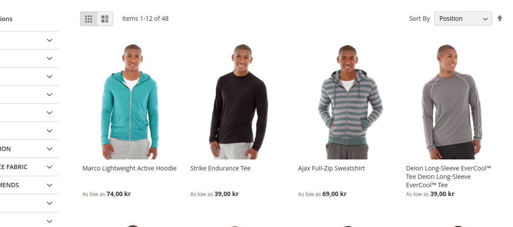

# Kadoco align products in product listing for Magento 2

## Overview

This module, developed by Kadoco, it aligns the products in the product listing /category pages so that the total height of the product card becomes the same for all products  

## Features

* Before

* After

So basically if a row of products has a product name that takes more rows, all products in the row becomes aligned with that one.

## Contributing

For any contributions, please make a pull request. We appreciate any contributions to improve this project.

## License

This project is licensed under the APACHE-2.0.

## Support

If you encounter any issues or require further information, please contact hej@kadoco.se.
